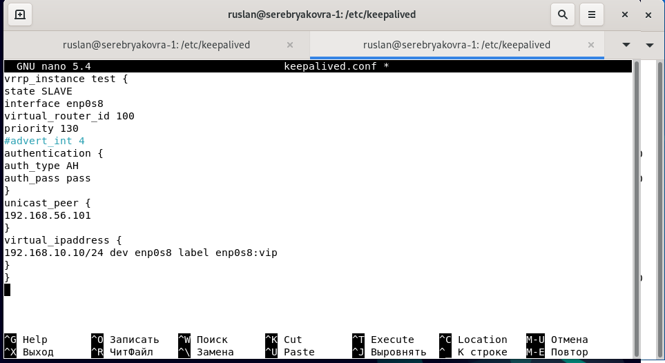

# Домашнее задание к занятию "10.1. Keepalived/vrrp" - Серебряков Руслан

### Задание 1. 

Требуется развернуть топологию из лекции и выполнить установку и настройку сервиса Keepalived. 

---
vrrp_instance test {

state "name_mode"

interface "name_interface"

virtual_router_id "number id"

priority "number priority"

advert_int "number advert"

authentication {

auth_type "auth type"

auth_pass "password"

}

unicast_peer {

"ip address host"

}

virtual_ipaddress {

"ip address host" dev "interface" label "interface":vip

}

}

---

*Пришлите  конфигурацию сервисов для каждой ноды и скриншот вывода команды  ip address.*

Сеть расположена на интерфейсе enp0s8

Конфигурация 1 ноды (nano /etc/keepalived/keepalived.conf)

IP 1 ноды (ip add)

--

Конфигурация 2 ноды (nano /etc/keepalived/keepalived.conf)

IP 2 ноды (ip add)

---
---

## Дополнительные задания (со звездочкой*)

Эти задания дополнительные (не обязательные к выполнению) и никак не повлияют на получение вами зачета по этому домашнему заданию. Вы можете их выполнить, если хотите глубже и/или шире разобраться в материале.
 
### Задание 2*.

Проведите тестирование работы ноды, когда один из интерфейсов выключен. Для этого:
- добавьте еще одну виртуальную машину и включите ее в сеть;
- на машине установите wireshark и запустите процесс прослеживания интерфейса;
- запустите процесс ping на виртуальный хост;
- выключите интерфейс на одной ноде (мастер), остановите wireshark;
- найдите пакеты ICMP, в которых будет отображён процесс изменения MAC адреса одной ноды на другой. 

 *Пришлите скриншот до и после выключения интерфейса из Wireshark.*

---

Пингуем с вирт. машины адрес 192.168.10.10 (тот самый vip который прописан на 2-х нодах)
На 2-х скриншотах видно, как пакеты приходят и уходят(красной рамкой выделены мак адреса). 
Так же видно, что пакет ушел на один мак и потом с него пришел овтет.

Спустя некоторое время я отключил сервис keepalived на самой приоритетной ноде (priority 130)
И через несколько секунд пакеты начали передаваться на вторую ноду, при этом IP адреса остались неизменны.
А вот мак поменятся 

